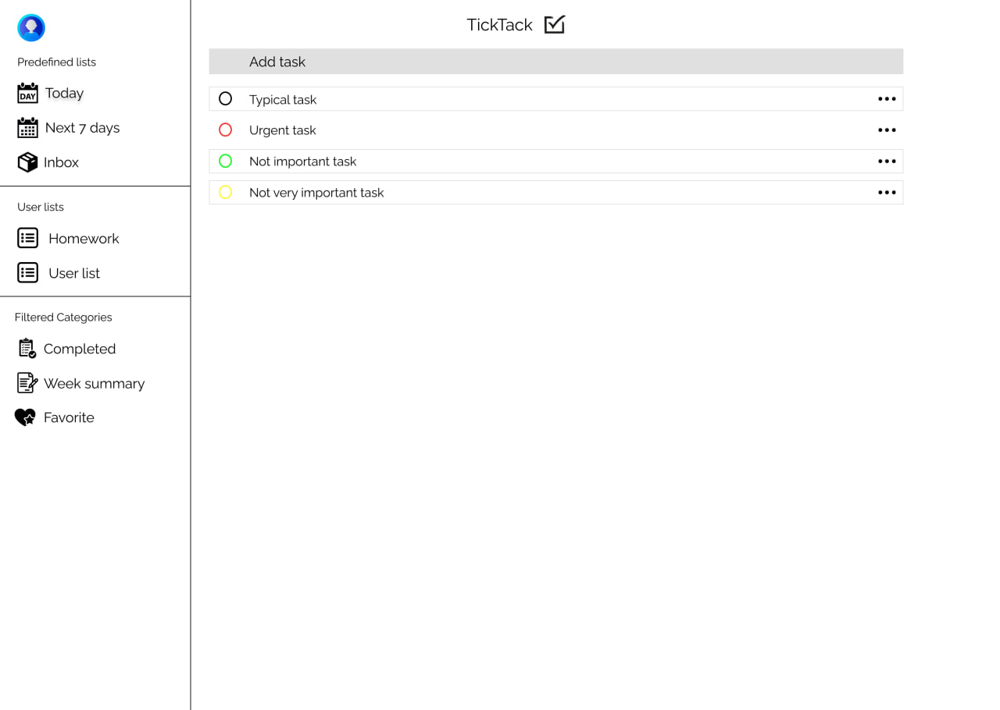
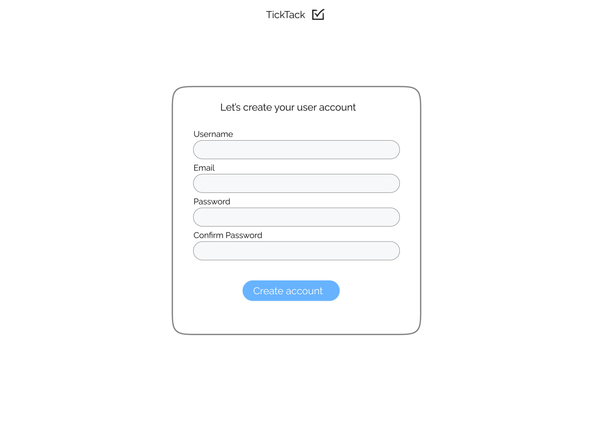
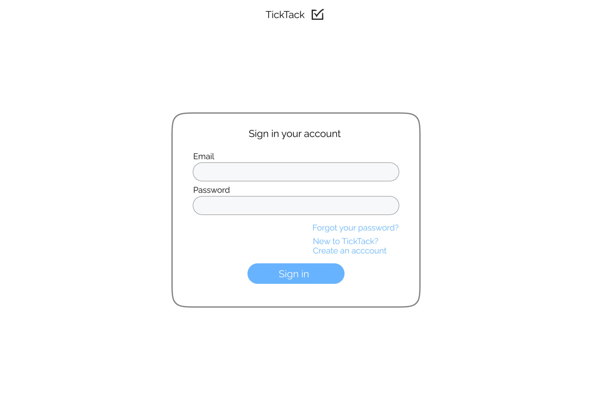
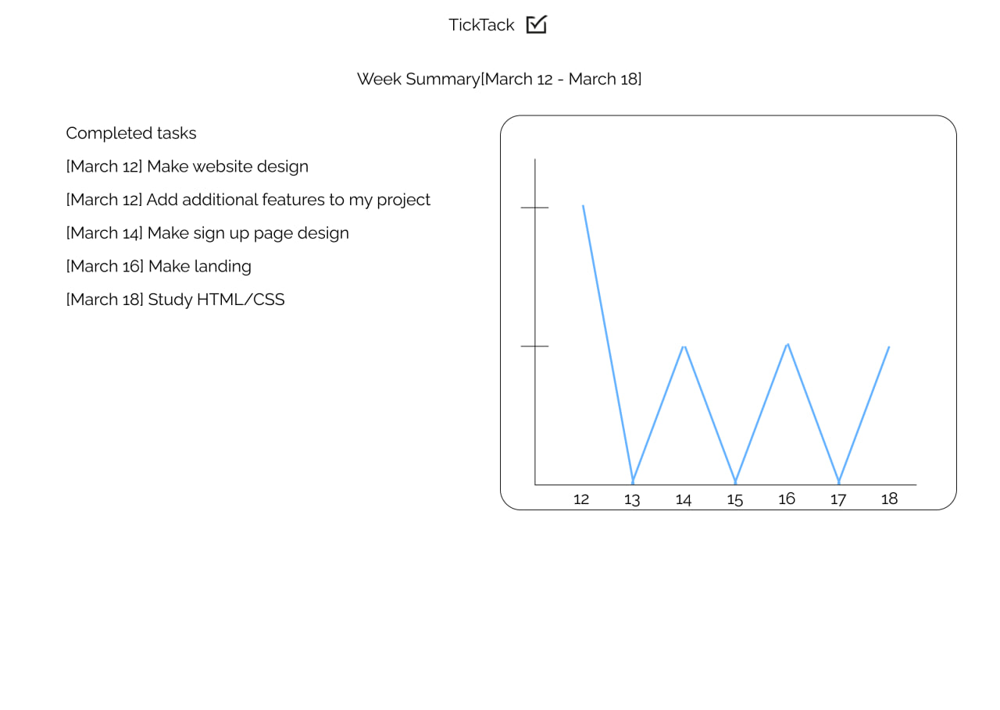

# TickTack

## Описание:
TickTack - это менеджер задач, который позволяет людям быть более продуктивными. Он может быть полезен студентам, учащимся, а также всем людям которые хотят улучшить свою самоорганизацию, дисциплину, помогает организовать аспекты своей жизни. Приложение позволяет анализировать результат своей работы благодаря выводимой статистике за неделю.

## Функции:
1. Раздел избранных задач
2. Регистрация и аутенфикация пользователя
3. Фильтрация задач по заданным параметрам
4. Задание приоритета задачи
5. Разбиение задач на группы
6. Показ статистики выполненных задач за неделю

## Модели данных:

### TaskGroup
|Field Name | Type  
|-----------|:-----------:|
| id | PK |
| name | text |

### Task
|Field Name | Type  
|-----------|:-----------:|
| id | PK |
| name | text |
| description | text |
| priority | Integer |
| is_favorite | Boolean |
| is_completed | Boolean |
| task_group_id | FK |

### User
|Field Name | Type  
|-----------|:-----------:|
| id | PK |
| username | text |
| password | text |
| email | text |

## Главная страница сайта

## Страница регистрации

## Страница входа в аккаунт

## Страница анализа недельной активности

